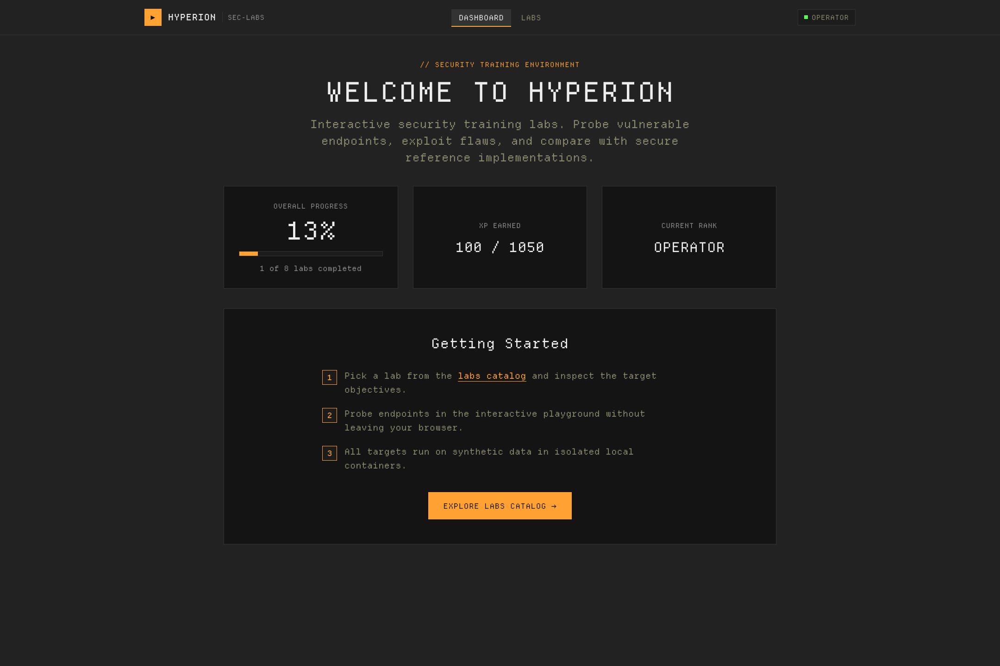

# Hyperion

> Modern, intentionally vulnerable web security training platform.



Hyperion is a modern, intentionally vulnerable cybersecurity training platform
inspired by [DVWA](https://github.com/digininja/DVWA), redesigned around the way
real applications are built today: REST APIs, token-based authentication,
client-side rendering, and containerized infrastructure.

It is designed to be run **locally only**, against **synthetic data**, inside an
isolated Docker environment.

## Highlights

- **Departure Mono Terminal Interface**: Authentic retro-futuristic developer aesthetic featuring Departure Mono typography, CRT pixel dot matrix canvas, strict zero-radius (`0px`) geometry, and high-contrast terminal color tokens.
- **Frictionless Operator Access**: Instant, silent auto-authentication—no manual login or registration required to start hacking.
- **Go (Gin) Backend**: High-performance REST API with structured logging, JWT token verification, and health probes.
- **React 18 + TypeScript + Vite Frontend**: Clean token-driven component architecture with responsive dashboard telemetry and real-time playground.
- **PostgreSQL Persistence**: SQL migrations with synthetic seed data and state tracking.
- **Reusable Lab Engine**: Every lab ships vulnerable behavior *and* a secure reference implementation (`-safe` twin), plus completion detection, hints, and XP tracking.
- **Interactive In-App Playground**: Drive every vulnerable endpoint directly from the browser—no external tools or curl required.
- **Fully Containerized**: Runs seamlessly with Docker Compose; isolated synthetic target network with no host filesystem exposure.

## MVP Labs

| Lab | Category | Difficulty | XP |
| --- | --- | --- | --- |
| SQL Injection | Injection | Easy | 100 |
| Stored XSS | Injection | Easy | 100 |
| IDOR / BOLA | Authorization | Easy | 100 |
| JWT Vulnerability | Authentication | Medium | 150 |
| SSRF | Request Forgery | Medium | 150 |
| Race Condition | Business Logic | Hard | 200 |
| Open Redirect | Request Forgery | Easy | 100 |
| Command Injection | Injection | Medium | 150 |

Per-lab guides with objectives, walkthroughs and mitigations live in
[`docs/labs/`](docs/labs/) ([sqli](docs/labs/sqli.md),
[xss](docs/labs/xss.md), [idor](docs/labs/idor.md), [jwt](docs/labs/jwt.md),
[ssrf](docs/labs/ssrf.md), [race-condition](docs/labs/race-condition.md),
[open-redirect](docs/labs/open-redirect.md),
[command-injection](docs/labs/command-injection.md)).

## Instant Access & Authentication

Hyperion eliminates authentication barriers for learners. When opening the web application, an operator session is silently and automatically initialized using the seeded demo credentials:

```
Email:    demo@hyperion.test
Password: Password123!
```

No manual login or account creation is required—you land directly on the centered dashboard with immediate access to all lab modules and progress tracking.

## Quick Start

```bash
cp .env.example .env          # generate local dev secrets
docker compose up --build     # start postgres, backend, frontend
```

- **Frontend**: http://localhost:5173
- **Backend API**: http://localhost:8080/api/v1/healthz

Open http://localhost:5173 in your browser to immediately access the Dashboard and Labs Catalog. Each lab includes an interactive **Playground** for crafting payloads and inspecting responses; the Race Condition lab includes one-click burst firing to exploit concurrency windows without scripting.

For local (non-Docker) development see [DEVELOPMENT.md](DEVELOPMENT.md).

## Documentation

- [LICENSE](LICENSE) — GNU General Public License v3
- [ARCHITECTURE.md](ARCHITECTURE.md) — system design and lab engine
- [DEVELOPMENT.md](DEVELOPMENT.md) — development workflow and testing
- [SECURITY.md](SECURITY.md) — security boundaries and responsible use
- `docs/labs/` — per-lab guides and solutions
- `docs/architecture/` — component deep-dives

## Legal & Intended Use

Hyperion is an educational platform. All vulnerabilities are intentional,
isolated, and exist only inside lab endpoints backed by synthetic data.
Never expose this application to untrusted networks. See
[SECURITY.md](SECURITY.md).
